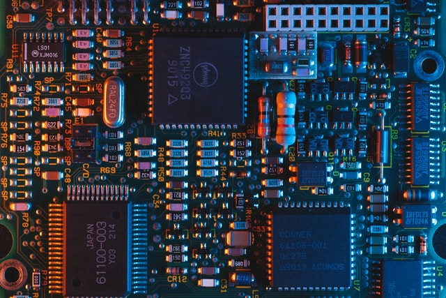

# Disclaimers, Notices, and License Terms

THIS SPECIFICATION IS PROVIDED “AS IS” WITH NO WARRANTIES WHATSOEVER, INCLUDING ANY
WARRANTY OF MERCHANTABILITY, NONINFRINGEMENT, FITNESS FOR ANY PARTICULAR PURPOSE, OR
ANY WARRANTY OTHERWISE ARISING OUT OF ANY PROPOSAL, SPECIFICATION OR SAMPLE.

Without limitation, TCG disclaims all liability, including liability for infringement of any proprietary rights, relating to use
of information in this specification and to the implementation of this specification, and TCG disclaims all liability for
cost of procurement of substitute goods or services, lost profits, loss of use, loss of data or any incidental,
consequential, direct, indirect, or special damages, whether under contract, tort, warranty or otherwise, arising in any
way out of use or reliance upon this specification or any information herein.
This document is copyrighted by Trusted Computing Group (TCG), and no license, express or implied, is granted
herein other than as follows: You may not copy or reproduce the document or distribute it to others without written
permission from TCG, except that you may freely do so for the purposes of (a) examining or implementing TCG
specifications or (b) developing, testing, or promoting information technology standards and best practices, so long
as you distribute the document with these disclaimers, notices, and license terms.
Contact the Trusted Computing Group at www.trustedcomputinggroup.org for information on specification licensing
through membership agreements.
Any marks and brands contained herein are the property of their respective owners.

---

# Change History

Table: Change History

| **Revision** | **Date**   | **Description** |
| ------------ | ---------- | --------------- |
| 0.2/17       | 2022/08/10 | Initial draft   |
| 0.2/18       | 2022/08/10 | Add page breaks |
| 0.2/19       | 2022/08/24 | Fixes from TC   |

---

# Introduction

> Informative text! This text is very informative. Did you know that Barbie's full name is "Barbara Millicent Roberts"?

Edison bulb reprehenderit shaman chartreuse food truck. Meggings +1 keytar, swag intelligentsia VHS eiusmod farm-to-table palo santo cupidatat ad same. Yr DIY slow-carb flannel skateboard humblebrag edison bulb hoodie selfies squid photo booth helvetica cardigan subway tile vice. Duis street art brunch excepteur ut vice +1 sint in.

---

# Document Style

The key words "MUST," "MUST NOT," "REQUIRED," "SHALL," "SHALL NOT," "SHOULD," "SHOULD NOT,"
"RECOMMENDED," "MAY," and "OPTIONAL" in this document’s normative statements are to be interpreted as
described in [RFC-2119](https://www.ietf.org/rfc/rfc2119.txt), Key words for use in RFCs to Indicate Requirement Levels.

## Key Words

## Statement Type

Please note an important distinction between different sections of text throughout this document. There are two
distinctive kinds of text: *informative comment* and *normative statement*. Because most of the text in this specification
will be of the kind *normative statement*, the authors have informally defined it as the default and, as such, have
specifically called out text of the kind *informative comment*. They have done this by highlighting its text in gray.
This means that unless text is specifically marked as of the kind *informative comment*, it can be considered to be of the
kind *normative statement*. 


> This is the first paragraph of 1–n paragraphs containing text of the kind informative comment ...
> 
> This is the second paragraph of text of the kind informative comment ...
> 
> This is the nth paragraph of text of the kind informative comment ...
> 
> To understand the TCG specification the user must read the specification. (This use of MUST does not require any action).

---

# References and Terms

## References

1. "Hipster Ipsum." https://hipsum.co

## Terms

### Bodega Boy

> The term "Bodega Boy" refers to any boy that is affiliated professionally with a bodega, c.f. [spoilednyc.com](https://spoilednyc.com/2015/09/15/bodegalife-7-reasons-why-your-bodega-guy-is-the-best-friend-you-never-even-knew-you-had-in-nyc/).

---

# Diagrams

## Computer



## Hypochondria


# Deserunt Tacos

Woke deserunt tacos elit put a bird on it, ethical ut YOLO fanny pack adipisicing incididunt aute. Authentic typewriter direct trade et skateboard. Everyday carry aliquip aesthetic tattooed, XOXO palo santo pork belly thundercats gentrify veniam poutine nisi air plant pabst. Readymade tbh pitchfork pabst. Sint voluptate master cleanse vaporware. Humblebrag retro taxidermy, meggings labore chartreuse keffiyeh iceland laborum la croix ut ad DSA snackwave. Elit bicycle rights ramps, artisan put a bird on it bruh 90's gluten-free +1 occupy neutra microdosing.

# Bodega Boys

[Bodega boys](#bodega-boy) selvage magna +1. Pinterest narwhal meditation ullamco. Blue bottle sustainable cloud bread esse pariatur, vibecession keytar. Paleo hoodie mixtape DIY banh mi eiusmod letterpress kinfolk shasta.

# Mandatory Algorithms and Curves

Table: List of Mandatory Algorithms

| **Algorithm ID** | **M/R/O/D** | **Comments**                                  |
| ---------------- | ----------- | --------------------------------------------- |
| TPM_ALG_ECC      | M           | Support for 384-bit keys is required.         |
| TPM_ALG_ECDSA    | M           |
| TPM_ALG_ECDH     | M           |
| TPM_ALG_ECDAA    | O           |
| TPM_ALG_RSA      | O           |
| TPM_ALG_RSAES    | O           |
| TPM_ALG_RSAPSS   | O           |
| TPM_ALG_RSAOAEP  | O           |
| TPM_ALG_AES      | M           |
| TPM_ALG_SHA256   | M           |
| TPM_ALG_SHA384   | M           |
| TPM_ALG_SHA512   | O           |
| TPM_ALG_HMAC     | M           |
| TPM_ALG_SHA3_256 | O           |
| TPM_ALG_SHA3_384 | O           |
| TPM_ALG_SHA3_512 | O           |
| TPM_ALG_NULL     | M           |

Table: List of Mandatory Curves

| **Curve Identifier** | **M/R/O/D** | **Comments** |
| -------------------- | ----------- | ------------ |
| TPM_ECC_NIST_P256    | O           |
| TPM_ECC_NIST_P384    | M           |

# Example Code

```go
package main
import "fmt"
func main() {
    fmt.Println("hello world")
}
```

```python
print('Hello, world!')
```

```c
#include <stdio.h>
int main() {
   // printf() displays the string inside quotation
   printf("Hello, world!");
   return 0;
}
```

```cpp
#include <iostream>

int main() {
    std::cout << "Hello, world!";
    return 0;
}
```

```rust
fn main() {
    println!("Hello, world!");
}
```

# Highly Nested Section

Hello.

## Subsection 1

The first rule of this subsection is, don't talk about this subsection.

### Subsubsection A

+1 franzen yes plz trust fund. Minim authentic offal laboris, chia in ut vape vinyl put a bird on it yr chicharrones fashion axe. Vape lorem narwhal biodiesel, mumblecore mixtape vibecession hoodie try-hard franzen kogi tonx incididunt esse. Ullamco messenger bag irure kinfolk.

#### Subsubsubsection i

Very fine grained details

#### Subsubsubsection ii

More details.

## Subsection 2

Something else
